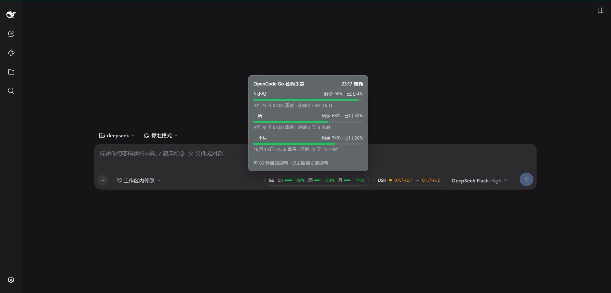

# dsh-ocg-used

[简体中文](README.md)

[DeepSeek Harness](https://github.com/deepseek-ai/deepseek-harness) plugin that displays the remaining OpenCode Go plan allowance in the composer toolbar: three progress bars for the 5-hour, weekly, and monthly windows, with used ratios, reset times, and countdowns available on hover.



## Features

- Persistent toolbar chip showing the remaining percentage for each window, with automatic status colors
- Hover panel showing remaining, used, reset time, time until reset, and the last update time
- Click the chip to refresh immediately; automatic refresh every 60 seconds
- Displays a localized reason when the API key is missing or the upstream request fails

## Compatibility

- DSH `>= 0.1.7-rc.1` (see `package.json#engines.dsh`), Node `^22.19.0 || >=24.0.0`
- Verified with the DSH 0.1.7-rc.1 Web profile
- Supports Linux, macOS, and Windows: the Host side uses Node's built-in `fetch`, so it does not depend on Bash, PowerShell, or a platform-specific `curl` command
- No runtime package dependencies: the Host side keeps only `@deepseek-ai/cordis` as a host-provided peer, while the browser-side React runtime comes from the host shell's module table
- Only one plugin in a composition may register `/opencode-go/quota`. If your DSH already provides the same route, disable one of the two plugins or startup will fail with `webserver: duplicate exact route "/opencode-go/quota"`

## Installation

The built `lib/` artifacts are committed to the repository, so installing from GitHub does **not** require build-script approval:

```sh
dsh plugin --profile web add github:windf1y/dsh-ocg-used
dsh web
```

Restart `dsh web` after installation. The chip will appear in the composer toolbar.

To update, remove the installed package first and then install it again:

```sh
dsh plugin --profile web remove dsh-ocg-used
dsh plugin --profile web add github:windf1y/dsh-ocg-used
```

To uninstall or inspect the current profile:

```sh
dsh plugin --profile web remove dsh-ocg-used
dsh plugin --profile web list
```

### Development from source

```sh
git clone https://github.com/windf1y/dsh-ocg-used.git
cd dsh-ocg-used
pnpm install
pnpm build
dsh plugin --profile web add ./dsh-ocg-used
```

A link installation has its own `node_modules`. After changing the source, run `pnpm build` again and refresh the page to load the new artifacts.

## Configure the API key

The plugin reads `OPENCODE_GO_API_KEY` through the DSH credential seam. The key itself is not written to the configuration file. `dsh-credentials-local` checks these locations in order:

1. The environment of the process that starts DSH (`OPENCODE_GO_API_KEY=… dsh web`)
2. `refs.OPENCODE_GO_API_KEY` in the credential store (the key saved in the GUI is stored there too)
3. `.env` in the project root
4. `.env` under the Harness home directory

Any one of these is sufficient:

```sh
OPENCODE_GO_API_KEY=sk-… dsh web
```

You can also save the key in the GUI settings or add it to the project-root `.env`:

```dotenv
OPENCODE_GO_API_KEY=sk-…
```

## How it works

- `src/index.ts` (Host): registers the read-only `GET /opencode-go/quota` route on `webServer`, applies the Connection trust check and browser authentication, and reuses one upstream read for 15 seconds because the upstream request itself counts toward the displayed quota.
- `src/usage.ts`: resolves the key through the credential seam and uses Node `fetch` for the upstream request. This is the same implementation on Linux, macOS, and Windows; the key stays in the Host request header and never reaches the browser, which receives percentages only.
- `src/protocol.ts`: defines the wire contract shared by the Host and browser halves: integer percentages, ISO reset timestamps, and a finite set of failure codes. User-facing copy stays in the client dictionaries.
- `src/client/`: registers the toolbar control in the `conversation.input.right` slot and the `opencodeGoQuota` dictionaries. CSS uses CSS Modules and the `--dsw-*` theme tokens.

### Percentage direction

The provider's `percent` value is the proportion already used. The three windows are nested: the 5-hour allowance is 20% of the monthly allowance, and the weekly allowance is 50%. Reading the value as used keeps recent 5-hour usage inside weekly usage and weekly usage inside monthly usage. The chip therefore displays `100 - percent` as remaining, while the hover panel shows both values.

## Build from source

```sh
pnpm install
pnpm typecheck   # type checking
pnpm build       # tsc outputs lib/types; tsdown outputs lib/index.js and lib/client.js
```

`lib/index.js` and `lib/client.js` are release artifacts committed to the repository. After changing the source, run `pnpm build` and commit the generated artifacts too; otherwise GitHub installations will receive the old build.

Optional npm publishing:

```sh
pnpm publish
```

The published files are limited to the `lib` artifacts, `cordis.patch.yml`, README files, and LICENSE.

## Directory structure

```
src/index.ts             Host half: registers the quota route
src/usage.ts             Resolves the key, calls the upstream API, and folds the response
src/protocol.ts          Shared wire contract
src/client/index.ts      Browser half: slot and dictionary registration
src/client/QuotaChip.tsx Toolbar quota chip component
cordis.patch.yml         Bundle patch that inserts the Host plugin
tsdown.config.ts         Host and browser bundles, including CSS Modules
README.md                Chinese documentation and the default GitHub entry
README.en.md             English documentation
```

## License

[MIT](LICENSE). Some code is adapted from DeepSeek Harness, which is also licensed under MIT.
