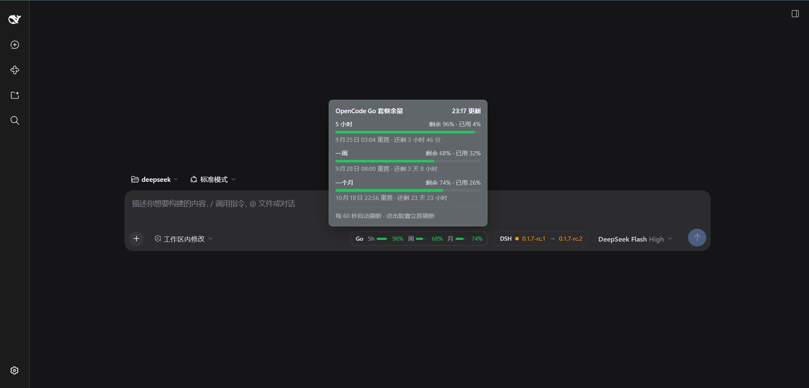

# dsh-ocg-used

[DeepSeek Harness](https://github.com/deepseek-ai/deepseek-harness) 插件：在输入框右侧工具栏显示 OpenCode Go 套餐的剩余额度 —— 5 小时、一周、一个月三个窗口各一条进度条，鼠标悬停看已用比例、重置时间点和倒计时。



## 功能

- 工具栏胶囊常驻，逐个窗口显示剩余百分比，按余量自动变色（充足 / 偏紧 / 告急）
- 悬停面板：每个窗口的剩余、已用、重置时刻、距重置还剩多久，以及本次数据更新时间
- 点击胶囊立即刷新；平时每 60 秒刷新一次
- 未配置 Key 或上游失败时显示「余量不可用」，悬停给出具体原因

## 兼容性

- DSH `>= 0.1.7-rc.1`（见 `package.json#engines.dsh`），Node `^22.19.0 || >=24.0.0`
- 已验证环境：DSH 0.1.7-rc.1 的 Web profile
- 运行时零依赖：Host 半只把 `@deepseek-ai/cordis` 留给宿主提供，其余代码全部打进产物；浏览器半的 React 由宿主 shell 的模块表提供
- 同一个 composition 里只能有一份注册 `/opencode-go/quota` 的插件。如果你的 DSH 已经内置了同名路由（例如自己 fork 过 Web bundle），同时启用两边会以 `webserver: duplicate exact route "/opencode-go/quota"` 启动失败，需要禁用其中一个

## 安装

仓库里已经提交了构建产物 `lib/`，所以从 GitHub 安装**不需要**任何构建脚本授权：

```sh
dsh plugin --profile web add github:windf1y/dsh-ocg-used
dsh web
```

装好后重启 `dsh web`（bundle 列表的变化在下次启动生效），工具栏就会出现胶囊。之后：

```sh
# 更新到最新
dsh plugin --profile web add --force github:windf1y/dsh-ocg-used
# 卸载
dsh plugin --profile web remove dsh-ocg-used
# 确认当前 profile 里装了什么
dsh plugin --profile web list
```

### 从源码开发

```sh
git clone https://github.com/windf1y/dsh-ocg-used.git
cd dsh-ocg-used
pnpm install
pnpm build
dsh plugin --profile web add ./dsh-ocg-used
```

link 安装的包有自己的 `node_modules`；改完源码重新 `pnpm build`，刷新页面即可看到新产物。

## 配置 API Key

插件通过 DSH 的凭据 seam 读 `OPENCODE_GO_API_KEY`，值本身不会进配置文件。`dsh-credentials-local` 的查找优先级是：

1. 启动 dsh 的那个进程环境（`OPENCODE_GO_API_KEY=… dsh web`）
2. 凭据存储文件里的 `refs.OPENCODE_GO_API_KEY`（GUI 设置里保存的 key 也写在这里）
3. 项目根目录的 `.env`
4. harness home 下的 `.env`

任选其一即可：

```sh
OPENCODE_GO_API_KEY=sk-… dsh web
```

或者在 GUI 的设置界面里保存这个 key，或写进项目根的 `.env`：

```dotenv
OPENCODE_GO_API_KEY=sk-…
```

## 工作原理

- `src/index.ts`（Host 半）：向 `webServer` 注册只读路由 `GET /opencode-go/quota`，自己套用 Connection 的信任检查与浏览器认证（该路由不在 `/api` 通道上）；15 秒内复用同一次读取，因为上游请求本身就计入套餐用量。
- `src/usage.ts`：通过凭据 seam 取 Key，通过 shell seam 执行一次 `curl`。Key 只走子进程环境变量，不进命令行，也永远不到浏览器；浏览器只拿到百分比。
- `src/protocol.ts`：两半共享的线上契约 —— 整数百分比、ISO 重置时刻、有限的失败码。Host 端不产出面向用户的文案，所有文案都在 client 词典里。
- `src/client/`（浏览器半）：在 `conversation.input.right` 槽位注册一个控件，并注册 `opencodeGoQuota` 词典；CSS 走 CSS Modules，颜色全部取自 `--dsw-*` 主题 token。

### 百分比的方向

上游返回的 `percent` 是「已用掉」的比例。三个窗口是嵌套的 —— 5 小时的额度是月度额度的 20%，周额度是 50% —— 所以只有「已用」口径能保证 5 小时用量落在周内、周落在月内；把它读成「剩余」会得出「最近 5 小时花掉的比整周还多」的矛盾结果。胶囊因此显示 `100 - percent` 作为剩余，悬停面板里同时给出两个数字。

## 从源码构建

```sh
pnpm install
pnpm typecheck   # 类型检查
pnpm build       # tsc 产出 lib/types，tsdown 产出 lib/index.js 与 lib/client.js
```

`lib/index.js` 和 `lib/client.js` 是提交进仓库的发布产物。改完源码要重新 `pnpm build` 并一起提交，否则从 GitHub 安装的人拿到的是旧产物。

发布到 npm（可选）：`pnpm publish`，`files` 只包含 lib 产物、`cordis.patch.yml`、README 和 LICENSE。

## 目录结构

```
src/index.ts          Host 半：注册用量路由
src/usage.ts          取 Key、调上游、折叠成浏览器视图
src/protocol.ts       两半共享的线上契约
src/client/index.ts   浏览器半：槽位与词典注册
src/client/QuotaChip.tsx  工具栏胶囊组件
cordis.patch.yml      作为 bundle 安装时插入的插件行
tsdown.config.ts      Host 产物 + 浏览器 bundle（含 CSS Modules 编译）
```

## 许可

[MIT](LICENSE)。部分代码来自 DeepSeek Harness（同样 MIT）。
